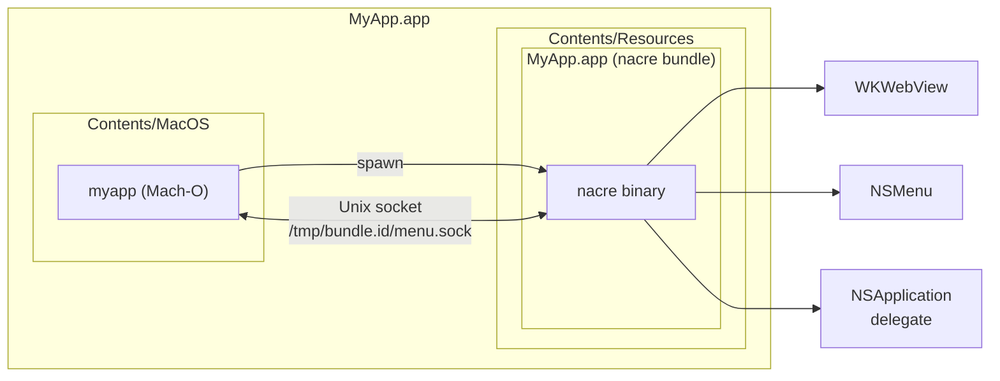
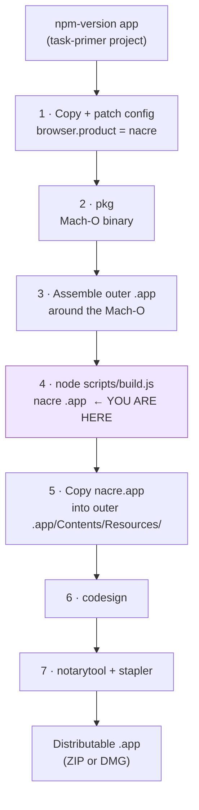

# nacre

A macOS application shim that gives a [task-primer](https://github.com/ciacob/task-primer)-based app a fully native macOS identity — custom name, icon, and menu bar — while using **WebKit** (WKWebView) as the rendering engine. No Chromium embedding, no separate browser process: the web content lives inside a real `NSWindow` that nacre owns entirely.

Named after the substance that turns an unfinished irritant into a pearl.

---

## How it fits into the bigger picture

nacre sits between a Node.js host application and macOS. The host spawns nacre, connects to its Unix socket, and drives everything declaratively over JSON. nacre translates those instructions into native AppKit/WebKit calls and reports user interactions back.



nacre is a **passive renderer**. It has no opinion about what the application does. The Node.js host drives everything; nacre translates between the Node.js world (JSON over a Unix socket) and the macOS world (WKWebView, NSMenu, NSApplicationDelegate events).

---

## Repository layout

```
nacre/
├── shim/                        Swift package — the native macOS shim binary
│   ├── Package.swift
│   ├── Resources/
│   │   └── Info.plist           Template patched per application at build time
│   ├── Sources/
│   │   ├── nacreLib/            Testable logic (no Cocoa app lifecycle)
│   │   │   ├── ArgvParser.swift         CfT-style argv → typed NacreArgs
│   │   │   ├── MenuBuilder.swift        JSON descriptors → NSMenu object graph
│   │   │   ├── MenuDescriptor.swift     Wire protocol types (Codable)
│   │   │   ├── SocketServer.swift       Unix domain socket server
│   │   │   ├── WebViewController.swift  WKWebView owner
│   │   │   └── WindowController.swift   NSWindow owner
│   │   └── nacre/               Cocoa glue (thin, not unit-tested)
│   │       ├── AppDelegate.swift        Wires all layers together
│   │       └── main.swift               Entry point
│   └── Tests/
│       └── nacreTests/          XCTest suites — 97 tests
├── scripts/                     Node.js build + packaging scripts
│   ├── build.js                 CLI entry point
│   ├── lib/
│   │   ├── assemble.js          Bundle assembly
│   │   ├── plist.js             Info.plist token patching
│   │   └── validate.js          Config file validation
│   └── test/                    node:test suites — 58 tests
├── e2e-testing/
│   └── menu/                    Manual E2E fixture for menu management
│       ├── fixture.js
│       └── menu.json
└── LICENSE                      Apache 2.0
```

---

## Build pipeline context

nacre covers **one step** of a larger orchestrator pipeline that turns a working npm-version task-primer app into a distributable macOS `.app`:



The orchestrator pipeline is outside nacre's scope. nacre only handles step 4.

---

## Socket protocol

All messages are **newline-delimited JSON frames**.

### Inbound (Node.js → nacre)

| Message | Purpose |
|---|---|
| `set_menu` | Replace the entire menu bar |
| `patch_menu` | Update specific items by id (no full rebuild) |
| `set_url` | Load a URL in WKWebView |
| `set_script` | Inject a JS guard script (runs before page code on every navigation) |
| `set_devtools` | Enable or disable the WebKit Web Inspector |

**`set_menu`**
```json
{
  "type": "set_menu",
  "menus": [
    {
      "label": "File",
      "items": [
        { "id": "file.new",   "label": "New",   "key": "n", "modifiers": ["cmd"] },
        { "id": "file.open",  "label": "Open…", "key": "o", "modifiers": ["cmd"] },
        { "type": "separator" },
        { "id": "file.close", "label": "Close", "key": "w", "modifiers": ["cmd"],
          "enabled": false }
      ]
    }
  ]
}
```

**`patch_menu`**
```json
{
  "type": "patch_menu",
  "patches": [
    { "id": "file.save",  "enabled": true },
    { "id": "view.theme", "label": "Dark Mode", "checked": true }
  ]
}
```

Supported patch fields: `label`, `enabled`, `checked`.

**`set_url`**
```json
{ "type": "set_url", "url": "http://127.0.0.1:3000" }
```

**`set_script`**
```json
{ "type": "set_script", "script": "(function(){ /* guard code */ })()" }
```

**`set_devtools`**
```json
{ "type": "set_devtools", "enabled": true }
```

### Outbound (nacre → Node.js)

| Message | Trigger |
|---|---|
| `menu_action` | User activated a menu item |
| `file_open` | macOS delivered a file-open request (registered UTI, Finder, drag-to-Dock) |
| `app_reopen` | User clicked the Dock icon while the app is already running |
| `window_closed` | User closed the main window (red button) |

```json
{ "type": "menu_action",   "id": "file.new" }
{ "type": "file_open",     "paths": ["/Users/me/doc.myext"] }
{ "type": "app_reopen" }
{ "type": "window_closed" }
```

### Socket path convention

```
/tmp/<CFBundleIdentifier>/menu.sock
```

Both sides derive the path independently from the same bundle identifier — nacre reads it from `NSBundle.main.bundleIdentifier` at runtime; the Node.js host reads it from `taskPrimer.appBundleId` in `package.json`.

Pass `--nacre-socket=<path>` to override (used by the E2E fixture and useful in development).

---

## Supported argv flags

nacre accepts Chrome for Testing-style flags so that task-primer's existing launch arguments pass through unchanged.

| Flag | Action |
|---|---|
| `--app=<url>` | Load this URL in WKWebView on startup |
| `--window-size=W,H` | Set initial window size in CSS pixels |
| `--window-position=X,Y` | Set initial window position (top-left origin, converted to macOS coordinates) |
| `--nacre-socket=<path>` | Override the default Unix socket path |
| `--no-first-run` | Silently ignored |
| `--no-default-browser-check` | Silently ignored |
| `--disable-extensions` | Silently ignored |
| `--remote-debugging-port=*` | Silently ignored |
| *(any other flag)* | Collected in `NacreArgs.ignored`, logged at startup |

---

## Building the shim

**Requirements:** macOS 13+, Xcode Command Line Tools.

```bash
xcode-select --install   # once, if not already installed

cd shim
swift build -c release   # → .build/release/nacre
swift test               # runs all 97 XCTest cases
```

The binary is cached — subsequent `node scripts/build.js` runs skip the compile step unless `.build/release/nacre` is deleted.

---

## Packaging (per application)

### Config file

Create a `nacre.config.json` for each application:

```json
{
  "app": {
    "name":     "My App",
    "bundleId": "com.example.myapp",
    "version":  "1.0.0",
    "icon":     "./assets/MyApp.icns"
  },
  "output": {
    "dir": "./dist"
  }
}
```

All paths are resolved relative to the config file. No `browser` section — nacre uses WebKit (system-provided), so there is nothing to download or vendor.

### Run the build script

```bash
node scripts/build.js --config /path/to/nacre.config.json
```

Output: `<output.dir>/<AppName>.app` — a self-contained bundle ready to be placed inside the outer application and signed.

### Bundle layout produced

```
My App.app/
└── Contents/
    ├── Info.plist          ← patched from template
    ├── MacOS/
    │   └── nacre           ← shim binary (chmod +x)
    └── Resources/
        └── AppIcon.icns    ← from app.icon
```

### Signing and notarization (orchestrator's responsibility)

After the orchestrator places `My App.app` inside the outer bundle:

```bash
# Sign everything recursively
codesign --deep --force --sign "Developer ID Application: …" OuterApp.app

# Submit for notarization
xcrun notarytool submit OuterApp.app \
  --apple-id … --team-id … --password … --wait

# Staple the notarization ticket
xcrun stapler staple OuterApp.app
```

---

## Manual E2E testing

The `e2e-testing/menu/` fixture lets you drive the full stack manually — real nacre binary, real socket, real NSMenu, real human interaction:

```bash
cd e2e-testing/menu
node fixture.js
```

Type `help` at the `nacre>` prompt to see available commands (`patch`, `menu`, `url`, `devtools`, `quit`). See [`e2e-testing/menu/README.md`](e2e-testing/menu/README.md) for the full manual test checklist.

---

## License

Apache License 2.0 — see [LICENSE](LICENSE).
